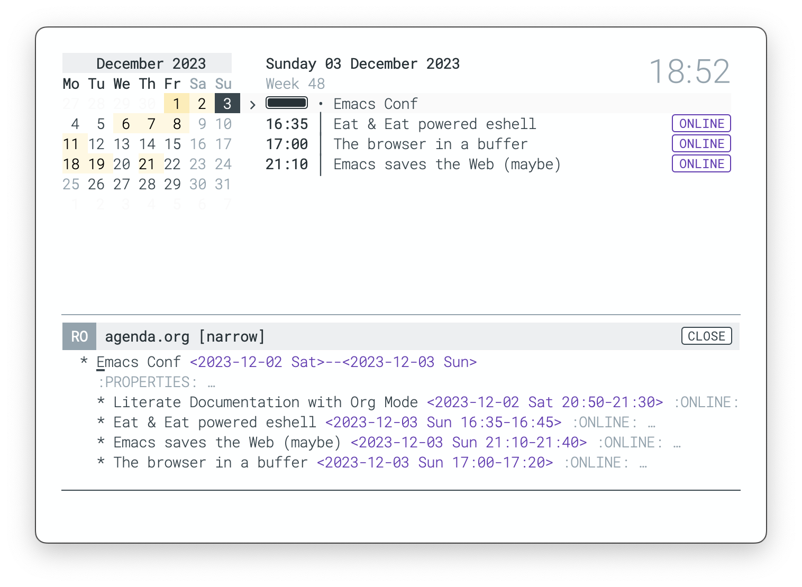

## GNU Emacs / N Λ N O Agenda

N Λ N O agenda is a minimal view of your org agenda files. It displays
a calendar view of current month (or the month corresponding to the
current selected date) alongside a view of your agenda displaying entries. 




## Usage

```elisp
(require 'nano-agenda)
(nano-agenda)
```
Agenda entries that are shown depends on `nano-agenda-filter-predicate` that is used to filter out entries. Calendar colors comes from  `nano-agenda-occupancy-predicate` that measure occupancy for a given entry. Entries are sorted according to `nano-agenda-sort-predicate` and conflicting entrie (e.g. time overlap) are detected using `nano-agenda-conflict-predicate`. 

## Dependencies

- [svg-lib](https://elpa.gnu.org/packages/svg-lib.html) is necessary for SVG tags, progress bars and clock.
- If you want header buttons, you'll need (nano-modeline)[https://elpa.gnu.org/packages/nano-modeline.html] (optional)


## Configuration

If you want `nano-agenda` to be shown in its own frame, you can use:

```elisp
(defvar my/nano-agenda-frame nil
  "Frame containing the nano agenda")

(defun my/nano-agenda-toggle ()
  "Show an agenda in a dedicated frame"
  
  (interactive)
  (if (not (and my/nano-agenda-frame (frame-live-p my/nano-agenda-frame)))
      (progn
        (setq my/nano-agenda-frame (make-frame '((width . 80)
                                                 (height . 20))))
        (select-frame-set-input-focus my/nano-agenda-frame)
        (modify-frame-parameters my/nano-agenda-frame
                                 '((user-position . t)
                                   (top . 50)
                                   (left . (- 10))))
        (select-frame-set-input-focus my/nano-agenda-frame)
        (nano-agenda))
    (if (frame-visible-p my/nano-agenda-frame)
        (let ((frames (frame-list)))
          (make-frame-invisible my/nano-agenda-frame)
          (catch 'visible-frame
            (dolist (frame frames)
              (when (frame-visible-p frame)
                (select-frame-set-input-focus frame)
                (throw 'visible-frame nil)))))
      (make-frame-visible my/nano-agenda-frame))
    (nano-agenda-update)))
```
